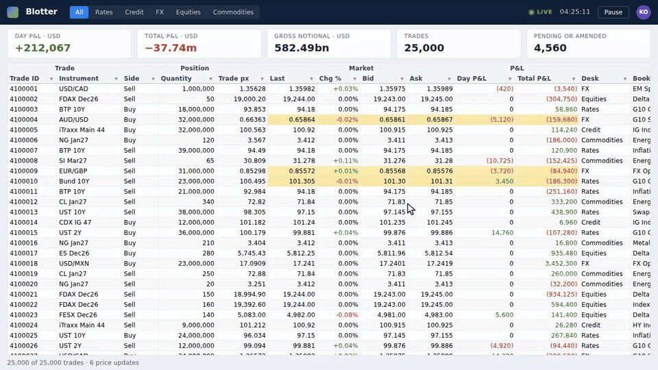
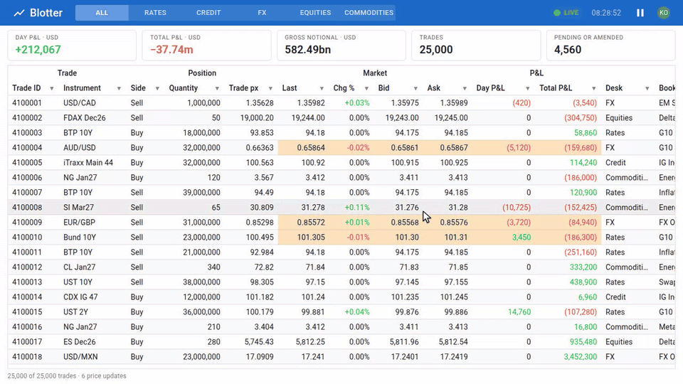
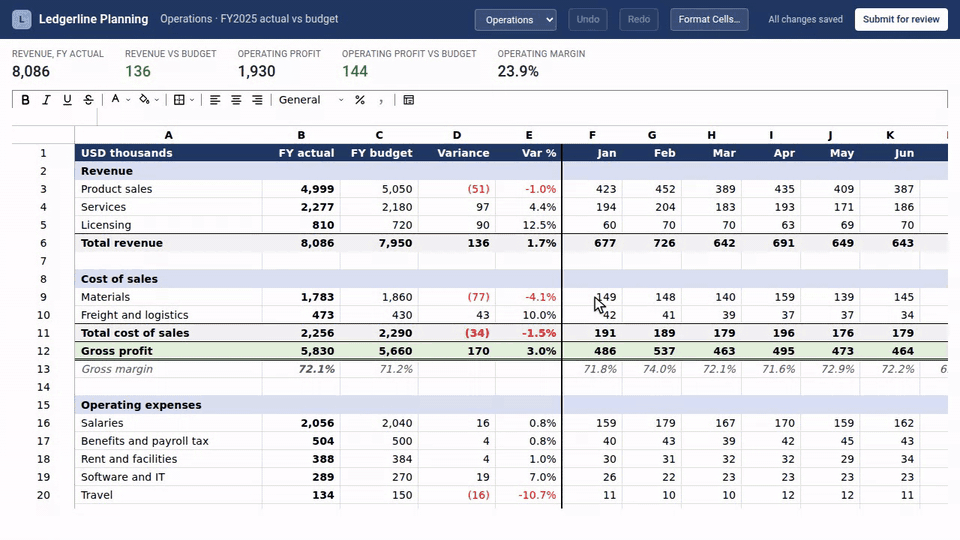
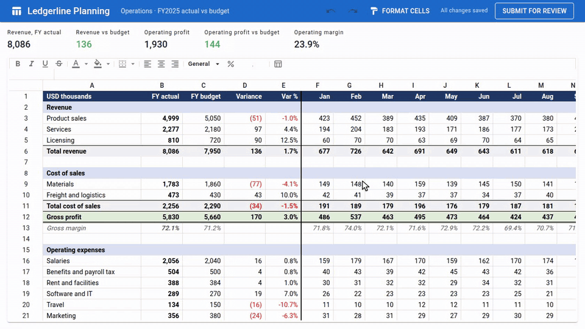
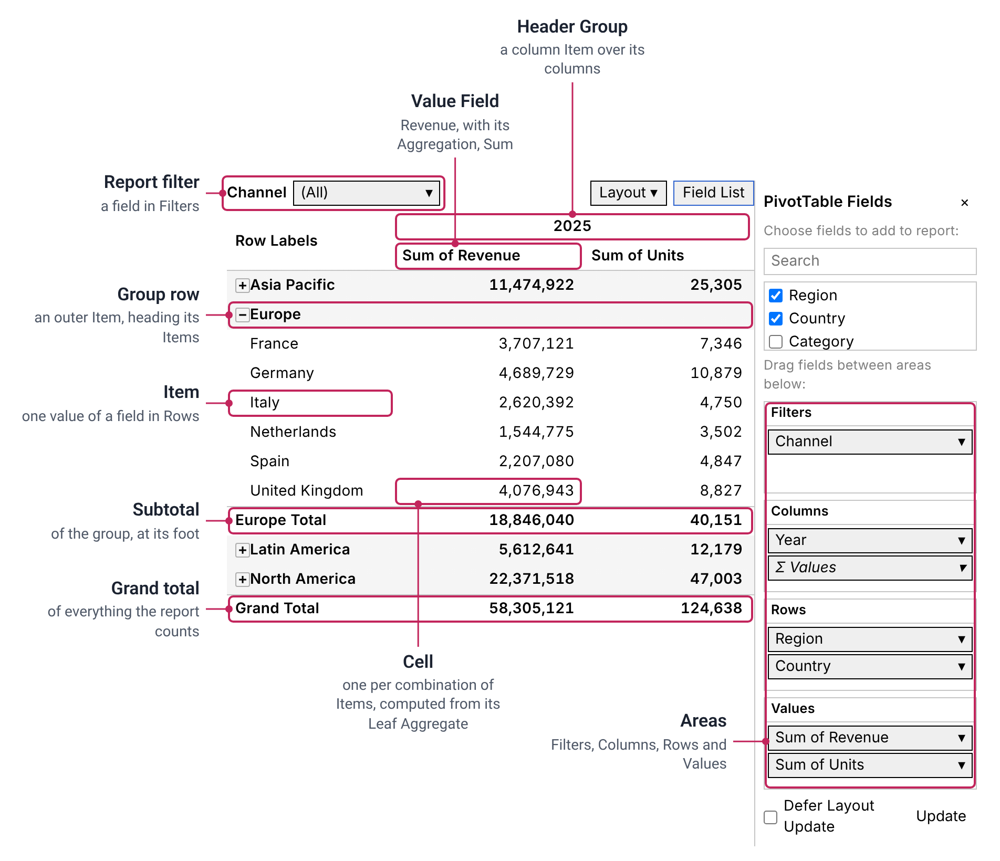
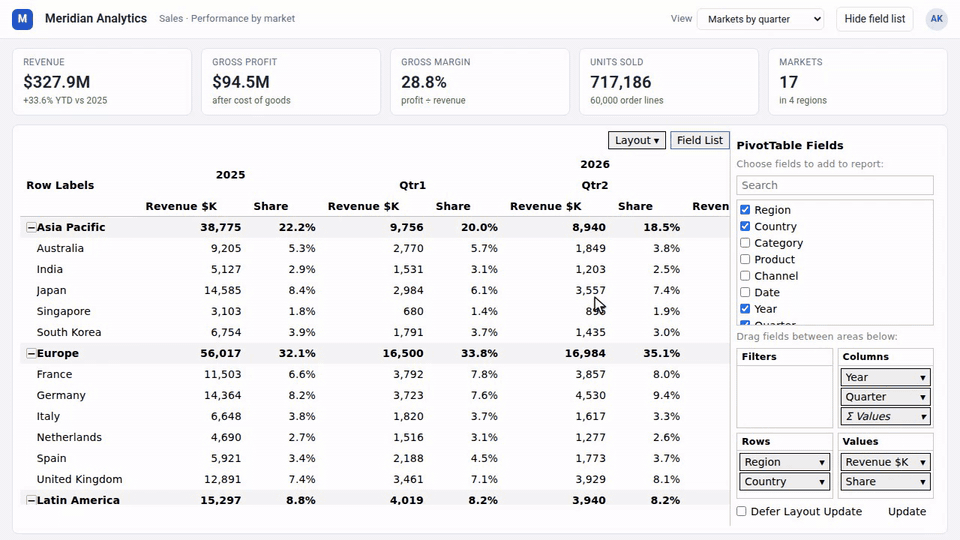
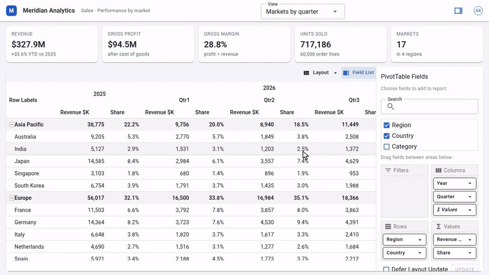

# ExGrid

[](https://github.com/AkiraMisawa/ex-grid/actions/workflows/ci.yml)
[](https://www.nuget.org/packages/ExGrid)
[](https://akiramisawa.github.io/ex-grid/)
[](https://github.com/AkiraMisawa/ex-grid/blob/badges/coverage.md)
[](https://github.com/AkiraMisawa/ex-grid/blob/badges/coverage.md)
[](https://github.com/AkiraMisawa/ex-grid/blob/badges/coverage.md)
[](https://github.com/AkiraMisawa/ex-grid/blob/badges/coverage.md)
[](https://github.com/AkiraMisawa/ex-grid/blob/badges/coverage.md)

**Excel-like grids for Blazor, built for reading money and risk numbers.**

A spreadsheet user's selection, keyboard and clipboard, virtualised on both axes so a million rows
keep the same DOM, and a grid that refuses rather than guesses: a number that does not fit shows
`####`, never a shorter number, and a copy is never truncated.

**[Documentation and live examples →](https://akiramisawa.github.io/ex-grid/)**

[](https://akiramisawa.github.io/ex-grid/showcase/blotter)

One repository, three products, each a separate package:

| | |
|---|---|
| **ExGrid** | The grid. Display-oriented: your application holds the rows, ExGrid shows them and tells you what the user asked for |
| **ExSheet** | A general-purpose sheet — cells addressed `A1`, Formulas computed as Excel computes them — drawn by ExGrid |
| **ExPivot** | Excel's PivotTable — Filters, Columns, Rows and Values in a Fields pane — drawn by ExGrid |

Each has a MudBlazor Wrapper (`ExGrid.MudBlazor`, `ExSheet.MudBlazor`, `ExPivot.MudBlazor`).

## Features

### ExGrid

- **Virtualised on both axes** — a million rows and a hundred columns render the same DOM
- **Pinned columns**, **Header Groups**, column resize and reorder
- **Rectangular selection** and the keyboard as Excel has them: arrows, Ctrl+arrows, Shift to
  extend, Enter and Tab cycling, typing to enter a cell
- **Copy and paste** as a spreadsheet user expects, with the shape rules written down; Delete,
  Ctrl+D / Ctrl+R and Ctrl+Z, with your application keeping the history
- **Sorting and filtering**, with filter panels and a column menu; the bundled
  `GridSource.From` sorts and filters a list in memory, or your server does it
- **Find (Ctrl+F)** over every row, not only the painted ones
- **Excel's status-bar figures** (Average, Count, Sum…) over the selection, every selected row included
- **Cell editing** and validation, a **Context Menu**, Row Stripes, live updates
- **Replaceable Chrome** — menus, filter panel, Cell Editor and loading indicator are seams a
  design system fills; swapping them does not change behaviour


<details>
<summary>The same under MudBlazor</summary>

[](https://akiramisawa.github.io/ex-grid/showcase/blotter?chrome=mud)

</details>

### ExSheet

- Excel's extent, 1,048,576 rows by 16,384 columns, held sparsely
- Formulas in Excel's syntax with a declared set of functions, each giving Excel's result — a
  function outside the set is `#NAME?`, never an approximation
- Recalculation of only what a change reaches; circular references reported as `#CIRC!`
- Formula Bar, Name Box, Headings, completion of function and table names, pointing at cells
  with the arrows or the mouse while a Formula is typed
- Insert and delete rows and columns, the fill handle, Format Cells (number format, alignment,
  font, fill, borders), an opt-in toolbar
- The **Sheet Document** is yours to keep: Entries, never Values, so a saved Sheet recomputes the
  same on a server as in the browser


[](https://akiramisawa.github.io/ex-grid/showcase/budget)

<details>
<summary>The same under MudBlazor</summary>

[](https://akiramisawa.github.io/ex-grid/showcase/budget?chrome=mud)

</details>

### ExPivot

- Excel's PivotTable semantics: Sum to Varp, subtotals and grand totals, the Compact, Outline
  and Tabular forms, expand and collapse, Hidden Items, sorting by label or value, Show Values As,
  Show Details
- The **PivotTable Fields** pane with drag and drop, Field Settings and Value Field Settings
- Money summed exactly — never through a `double`
- In-process data, CSV, a database, or a server answering with leaf aggregates; live data folded
  in as Change Batches

The parts of a pivot, as [the Docs Site](https://akiramisawa.github.io/ex-grid/expivot) and the API name them:

[](https://akiramisawa.github.io/ex-grid/expivot)

[](https://akiramisawa.github.io/ex-grid/showcase/sales)

<details>
<summary>The same under MudBlazor</summary>

[](https://akiramisawa.github.io/ex-grid/showcase/sales?chrome=mud)

</details>

## Quick start

```sh
dotnet add package ExGrid --prerelease
```

Link the stylesheet in your host page (`wwwroot/index.html`, or `App.razor` in a Blazor Web App):

```html
<link rel="stylesheet" href="_content/ExGrid/ex-grid.min.css" />
```

```razor
@using ExGrid
@using ExGrid.Components

<ExGrid TRow="Trade" Source="_source" Columns="_columns" />

@code {
    private readonly InMemoryGridSource<Trade> _source = GridSource.From(Trade.Sample());

    private readonly GridColumn<Trade>[] _columns =
    [
        new("Book", ColumnType.Text, t => t.Book),
        new("Notional", ColumnType.Number, t => t.Notional),
        new("TradeDate", ColumnType.Date, t => t.TradeDate),
    ];
}
```

The whole family is published to NuGet as prereleases at one shared `0.1.0-beta.N` version
([ADR-0042](docs/adr/0042-prereleases-ship-before-sign-off-and-only-a-stable-version-waits-for-it.md)).
Each package depends on exactly the versions of the others it was built with, so upgrade them
together. A MudBlazor application adds each product's Wrapper:

```sh
dotnet add package ExGrid.MudBlazor --prerelease    # for a MudBlazor application
dotnet add package ExSheet --prerelease             # the sheet; ExSheet.Engine alone computes on a server
dotnet add package ExSheet.MudBlazor --prerelease
dotnet add package ExPivot --prerelease             # the pivot table; ExPivot.Engine alone aggregates
dotnet add package ExPivot.MudBlazor --prerelease
dotnet add package ExGrid.Data.Arrow --prerelease   # a Snapshot as Apache Arrow
```

Each package's own readme takes it from there:

| Product | Readmes |
|---|---|
| ExGrid | [`ExGrid`](src/ExGrid/README.md), [`ExGrid.MudBlazor`](src/ExGrid.MudBlazor/README.md) |
| ExSheet | [`ExSheet`](src/ExSheet/README.md), [`ExSheet.Engine`](src/ExSheet.Engine/README.md), [`ExSheet.MudBlazor`](src/ExSheet.MudBlazor/README.md) |
| ExPivot | [`ExPivot`](src/ExPivot/README.md), [`ExPivot.Engine`](src/ExPivot.Engine/README.md), [`ExPivot.MudBlazor`](src/ExPivot.MudBlazor/README.md) |
| Data | [`ExGrid.Data`](src/ExGrid.Data/README.md), [`ExGrid.Data.Arrow`](src/ExGrid.Data.Arrow/README.md) |

**Requirements:** .NET 10 or newer, Chrome or Edge, and an interactive render mode. ExGrid is
verified under WebAssembly; every browser test also runs under Blazor Server.

## See it running

Every component runs live on the **[Docs Site](https://akiramisawa.github.io/ex-grid/)**: each
page has Examples you can drive with the mouse and the keyboard, the code each one runs, and the
API. A switch at the top runs every Example under the built-in Chrome or MudBlazor's. The
Showcases are whole applications:
[a trade blotter](https://akiramisawa.github.io/ex-grid/showcase/blotter),
[a budget sheet](https://akiramisawa.github.io/ex-grid/showcase/budget) and
[a sales analysis](https://akiramisawa.github.io/ex-grid/showcase/sales).

To run the site locally, clone the repository (the .NET 10 SDK is all it needs; see
[CONTRIBUTING](CONTRIBUTING.md) for Nix) and open <http://localhost:5310>:

```sh
dotnet run --project samples/ExGrid.Docs --urls http://localhost:5310
```

## Design

- **Rather than be quietly wrong, say it cannot be done.** Copy is never truncated, paste never
  spills outside the selection, the selection is dropped when the order changes, and a number
  that does not fit becomes `####`.
- **The grid neither holds nor executes.** The data, sorting, filtering and edits belong to your
  application. The grid displays what it is given and tells you what the user asked for — or
  you hand it `GridSource.From` and let the bundled source do it.
- **Chrome renders; the core decides.** A design system replaces how the menus and editors look,
  never what they mean.
- **JavaScript only where Blazor cannot do the job**, on an allowlist.

Every decision is recorded with its reasons in [`docs/adr/`](docs/adr/), and the vocabulary in
[`CONTEXT.md`](CONTEXT.md).

## Status

**Beta.** The specification is settled and every test layer passes in CI, but the API may change
between betas. The family's ten packages ship together as `0.1.0-beta.N`; a stable version waits
for the [Definition of Done](docs/definition-of-done.md) to be signed off. What remains is in
[`docs/implementation-status.md`](docs/implementation-status.md).

## Contributing

Building the repository, its layout, the ground rules and the test layers are in
[CONTRIBUTING.md](CONTRIBUTING.md).

## License

[MIT](LICENSE).
