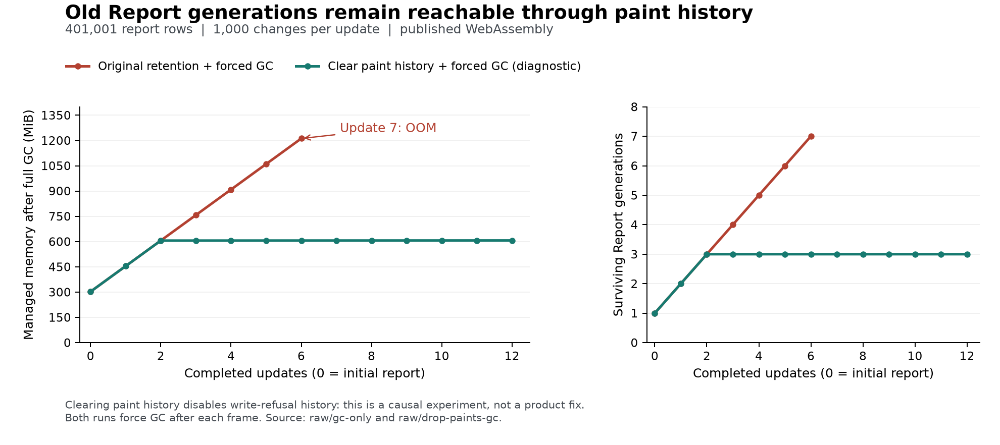

# Why the large live pivot exhausted browser memory

2026-10-06, base `bd4b2e45`, disposable `live-data-oom` worktree. This diagnoses the seventh-update
failure recorded in [the update-cost measurement](../2026-10-06-macos-live-update-costs/README.md).
It makes no product change or architectural decision.

**The dominant cause is retained report generations through ExGrid's paint history.** A saved
paint keeps the 18 painted row objects. Each `PivotReportRow` owns a reference to its entire
`PivotReport`, which owns all 401,001 report rows and its Cube. Consequently, keeping a few painted
rows keeps a whole report generation. After six updates, eight paints contained 144 row references
that reached seven different reports: **2,807,007 report rows**, and seven Cubes.

Forcing full GC between updates did not prevent memory exhaustion. Removing only the paint-history
references, while keeping the original one-second Change Highlight, allowed 20 updates to complete.
The corresponding full-GC comparison kept approximately 606 MiB of managed data instead of rising
by approximately **151.5 MiB per generation**. Clearing paint history is a **diagnostic intervention**,
not a fix: it discards the evidence ADR-0142 needs to judge a delayed gesture.

**One million input records are a different dimension from 400,000 aggregate leaves.** With one
million records and 1,000 leaves, the original product completed 70 live updates without intervention.
The existing `/pivot-csv` page also read a real 85,000,089-byte CSV containing one million records
and 12 declared columns, then displayed its 111-row report under the default caps. Neither test
raised the WebAssembly heap ceiling.

## Reproduce first, then isolate

The original published Release WASM page failed again in 16.7 seconds: six updates completed,
then update seven raised `System.OutOfMemoryException` while `PivotCube.BuildAsync` allocated a
`Dictionary<long, int>`. `raw/original/` retains that run and its exact error. The original
page/spec/config sources are archived in `harness/`.

A smaller runner removed the shared browser fixture, `/features` warm-up, long-task observer,
MutationObserver instrumentation and metric recording. It opens one page, presses one update
button at a time, and waits for changed report text followed by an animation frame. It reproduced
the same seventh-update exception; see `raw/minimal-driver/`. A later reduction from 1,000 changed
records to **one changed record per update** also failed on update seven. This establishes a small
repeatable trigger, not a claim to have found the absolute smallest leaf cardinality that can fail.

The hypotheses, ranked and communicated before the experiments, were:

1. **Old Report/Cube graphs remain reachable through presentation history or delegates.** Cutting
   the responsible reference should stop growth even with unchanged inputs and computations.
2. **The source's Snapshot or aggregation cache holds old input generations.** Growth should remain
   after presentation references are cut, and old Snapshot/Answer counts should keep rising.
3. **Whole-report reconstruction has a bounded live set but excessive temporary allocation or GC
   pressure.** Full GC between updates should materially change the outcome without a growing
   collection of reachable reports.
4. **WASM runtime/native memory growth dominates independently of managed retention.** Managed live
   data would remain bounded while WASM memory grew, and a managed reference-only intervention
   would not remove that trend.

The first hypothesis was supported, specifically ExGrid's paint history, not ExPivot's timed
`ReportHistory`. The source retained four sampled Snapshot versions and one current Answer after
full GC; ExPivot's Change Highlight history held two reports in the large case. Temporary allocation
is substantial, but the GC-only experiment and reference-cut experiment distinguish it from the
retention causing this failure. The WASM capacity remaining above managed live bytes was not
profiled into native allocations, fragmentation and free space; it must not all be called a native leak.

## Controlled observations

Same machine/runtime as the earlier measurement: Apple M4 Pro, 24 GiB, macOS 26.6.2, .NET 10.0.7
from SDK 10.0.203, Chrome 154.0.8037.98, headless, one worker and one fresh browser per run. Release
WASM uses IL without AOT, default slicing, a 1,400 × 1,100 browser viewport, and a 1,200 × 480 grid.
These diagnostic runs are not latency benchmarks.

The pathological fixture has 400,000 source records, two row fields (1,000 × 400 Items), one decimal
Sum and 401,001 report rows. Its original Consumer caps of one million leaves/rows are preserved;
the default 200,000-leaf cap would refuse this fixture before the failure. The runtime's default
2 GiB WASM heap ceiling is unchanged. No sleep, retry, timeout extension, cap adjustment or reduced
input was used to label this same scenario successful.

Each intervention differs from its comparison in one factor. The two full-GC cases differ only in
whether the paint references are cleared. Measurements below are after the last completed frame;
there is no frame measurement for a failed seventh update.

| Scenario | Completed updates | Outcome | Managed MiB at last sample | WASM memory capacity MiB | Reports directly reachable from paints |
| --- | ---: | --- | ---: | ---: | ---: |
| Instrumented baseline | 6 | Update 7: OOM in Cube dictionary allocation | 1,229.9 | 1,889.9 | 7 |
| Full GC only | 6 | Update 7: GC cannot allocate a major-heap section | 1,211.9 | 2,008.4 | 7 |
| Change Highlight duration = 0 only | 6 | Update 7: same Cube OOM | 1,227.9 | 1,889.8 | 7 |
| Batch size = 1 only | 6 | Update 7: same Cube OOM | 1,227.4 | 1,888.9 | 7 |
| Clear paints only | 20 | All requested updates completed | 657.4 | 1,200.9 | 0 |
| Clear paints + full GC | 12 | All requested updates completed | 606.7 | 1,306.9 | 0 |

The GC-only failure's exact message is `Garbage collector could not allocate 16384u bytes of memory
for major heap section.` It is memory exhaustion on update seven, but not the same managed exception
stack as the baseline. Both error forms remain in the raw evidence.



At matched update six, the full-GC baseline has seven surviving sampled reports, versus three with
paints cleared. The live-byte difference divided by those four additional reports is approximately
151.4 MiB each. The baseline's growth from initial display through six updates is 151.528 MiB per
update. This includes small input/history bookkeeping as well as each retained report graph; it is
not an exact object-size census. Clearing paints leaves three sampled reports/Cubes alive, not zero.
Those remaining roots were not fully enumerated; their size stays approximately constant over the
observed sequence (606.0–606.7 MiB after updates 3–12 with full GC).

**Allocation and retention are different measurements.** On the WASM main thread, each large update
allocated approximately 214.6 MiB (median of successive `GC.GetAllocatedBytesForCurrentThread`
readings), both with and without the paint references. In the paint-clear/full-GC run, cumulative
allocation reached 2,978.4 MiB while the post-GC managed footprint remained 606.7 MiB. A retention fix
therefore need not remove the cost of rebuilding Cube and Report. A type-by-type heap dump or
allocation attribution across Cube, trees, keys and report rows was not taken; it was unnecessary
to isolate this causal reference and would have delayed the separate A/B measurement.

## The retaining path and the design implication

The direct path, verified by reflection against the live component, is:

```text
ExGrid<PivotReportRow>._paints
  -> Paint.Rows (the small painted slice)
  -> PivotReportRow.Report
  -> PivotReport.Rows (401,001 rows) and PivotReport.Cube
```

[ExGrid.SeenText.cs](../../src/ExGrid/Components/ExGrid.SeenText.cs) keeps up to 64 paints, saving
row instances so `Paint.TextAt` can later recompute the text a gesture was taken against.
[PivotReport.cs](../../src/ExPivot.Engine/PivotReport.cs) gives each row its report owner for lazy
cell computation. [ReportHistory.cs](../../src/ExPivot/Components/ReportHistory.cs) separately keeps
the timed Change Highlight versions; in this case it is already bounded to two.

This is a **lifetime/ownership mismatch at the ExGrid–ExPivot boundary**, expressed by the object
references. It is not evidence that client-side aggregation, immutable data, or one million CSV
records are intrinsically impossible in a browser. Nor is it an unbounded leak: the paint list has
a limit of 64. That limit is still large enough to exhaust the 2 GiB addressable heap well before
it is reached when every saved painted row retains a full report generation.

A possible correction is to keep the needed painted text and detached identity evidence without
retaining a source row's entire object graph. That needs a design decision and correctness tests:

- Clearing/reducing paint history changes which delayed gestures can be judged.
- Weak references alone would make a judgement depend on GC timing.
- A generic Consumer Row Key may itself retain a large graph; storing it does not automatically
  make the retained evidence small. ExPivot's key also has to be considered.
- Mutating a report in place while old `Paint.TextAt` still recomputes through its row would read
  the newer value when asked what was painted earlier. Retained-report work must preserve ADR-0142's
  old-display evidence rather than silently changing its meaning.

No low-risk product fix was adopted or presented as verified here. The available one-line root cut
violates ADR-0142, so it remains an explicit diagnostic control. The reduced browser runner is a
regression seam for the original memory symptom once a correct design is implemented; write-race
correctness tests must accompany that implementation.

## One million records, with ordinary aggregate cardinality

| Observation | Input records | Input columns | Aggregate leaves | Report rows | Result | WASM capacity at last observation |
| --- | ---: | ---: | ---: | ---: | --- | ---: |
| Live in-memory fixture | 1,000,000 | 4 | 1,000 | 1,101 | 70 updates, no intervention, no console errors | 412.3 MiB |
| Actual CSV through `/pivot-csv` | 1,000,000 | 12 | 1,000 | 111 | File fully read; report painted; no refusal or console errors | 286.2 MiB |

The live fixture has 100 outer and 10 inner Items and applies 1,000 changes per update. Its paints
reached the real limit of 64, referencing 64 report generations; those contain 70,464 report rows in
total, rather than millions. Managed memory was approximately 147.1 MiB initially and 191.0 MiB at
update 70, without forced GC. A weak-reference target not yet collected in this run is not proof of
continued strong reachability; the direct paint-root count is the 64 shown above.

The CSV fixture is generated by `harness/make-csv.py`: 85,000,089 UTF-8 bytes, unique trade IDs,
10 Regions × 10 Desks × 10 Products, decimal Notional/P&L, and the demo's other declared columns.
The unmodified `/pivot-csv` route reads it with `DemoCsv.TradeExport` and uses its normal first layout
and default caps. Seventeen rows were painted. The page reported 1.9 seconds reading time, and the
single browser observation from file submission to visible DOM rows was 2.545 seconds. These are
one loading observation, not a latency distribution or a claim about every million-record file.
The 70 live updates were the separate four-column fixture; this CSV test covers load and initial
report display, not 70 updates of that CSV.

## Instrumentation, evidence and reproduction

Only the disposable sample and browser runner were instrumented; no `src/` change was needed.
The probe reads `GC.GetTotalMemory(false)`, both allocation counters, generation collection counts,
and `getDotnetRuntime(0).Module.HEAPU8.buffer.byteLength`. In full-GC cases it first calls `GC.Collect`,
waits for pending finalizers and collects again. Post-GC managed bytes are an estimate of the live
managed footprint; WASM buffer length is capacity, including more than live managed objects.
`GetTotalAllocatedBytes(false)` can be coarse between collections, so the per-update allocation
comparison uses the current-thread counter. All these observations are at settled report frames.

The sample holds **only `WeakReference<object>` entries** for sampled Report, Cube, Snapshot and
Answer objects. `tracked.created` is the count of distinct objects seen at those observation
points, not a constructor/allocation count; partially constructed failed objects are not included.
Reflection builds transient local arrays while serializing numeric counts and source-version strings.
Those arrays are not stored in the sample, and the browser receives only JSON. The same weak tracker
allows obsolete reports to disappear when paint references are cut, an additional check that the
probe is not itself keeping all versions alive. Full-GC cases, not uncollected weak targets alone,
establish the retained-generation counts.

Relevant files:

- `raw/original/` and `raw/minimal-driver/`: the original and reduced failure loops.
- `raw/{instrumented,gc-only,no-highlight,batch-one,drop-paints,drop-paints-gc}/result.json`:
  each completed update's managed/allocation/GC/WASM readings and observed root paths/counts.
- `raw/million-low-cardinality/` and `raw/million-csv/`: the two distinct million-record checks.
- `raw/summary.json`: derived values, checked by `harness/summarize.py`.
- `harness/plot_memory.py` and `memory-retention.png`: the full-GC comparison figure.
- `raw/exploratory/`: an invalid early probe whose missing non-nullable query parameters became
  zero, yielding an empty fixture. It was stopped and excluded. A publish overlapped that discarded
  run before its stop completed; every retained diagnostic run used a fresh browser/host against
  a completed publish. Nullable defaults corrected the fixture. No value from that run is in a table.

In a **disposable checkout at `bd4b2e45`**, copy this verification directory and run:

```sh
bash verification/2026-10-06-macos-pivot-memory/harness/prepare.sh
bash verification/2026-10-06-macos-pivot-memory/harness/run.sh instrumented
```

Preparation restores the archived sample/runner, git-adds the new files for nix, installs locked
browser dependencies and publishes once to `.memory-hosts/instrumented/wasm`. The second command is
the short red-capable loop: it is expected to fail on update seven on the measured base. The same
command accepts each scenario name from the table, including `million-csv`. Results go to
`.memory-rerun/<scenario>` by default, never over the retained evidence. The runner owns one static
host on 5499, never reuses a current host, and stops it at the end. Do not publish under a running
host or run beside another browser/performance measurement.

For the exact pre-instrumentation page, copy `harness/LiveCostPage.original.razor.txt` in place of the
instrumented sample, publish separately, and use the archived `measure-cost` spec/config with
`COST_PIVOT_INNER=400 --grep 'measure pivot'`, as the previous measurement's README describes.
The reduced runner without `OOM_PROBE=1` can drive that unchanged page too.

Cleanup leaves only this verification directory. Generated CSV, published hosts, trace ZIPs and
throwaway sample/test files are not retained. No commit/push or architectural documentation change
was made. No Docs Site change is needed because this is a disposable diagnosis and no product API
or behavior was adopted. No full test suite or additional local layer-3 suite was run.
